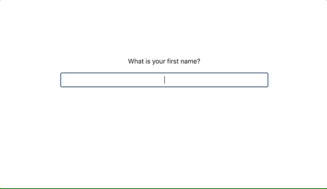

# Question interface spike

Two things I wanted to explore 

- Creating a conversational interface rather than the classic form approach
- Creating a simple approach to form validation use the browser inputs checkValidity() methods



## Spike outcomes

Regarding the above

 - I think further development of a standalone Questions component would be interesting
   - Accessiblity should be a top concern, had to do some additional work around ensuring refs were added properly to correctly establish focus
   - The QuestionTypes component factory should also be exposed so that its easy to add new question types. This would just reduce coupling with and other libraries and open it up more for customization
   - Might be useful to also think about how to relay progress through a set of questions. This is more difficult when given a number of branches that might effect the total number of questions.
 - Creating a simple reusable form and input library might be massively useful
   - [CheckValidity API](https://developer.mozilla.org/en-US/docs/Web/API/HTMLSelectElement/checkValidity)
 in browsers gives you all you need on the web for input validation. Effectively it would get rid of the need for things like formik.Inputs have been thought about here more traditional forms might want to consider
   - Some additional functionality might be useful and need to be thought about more
     - Being able to set form validation errors sent from the server endpoints after submission
     - Being able to easily set initial form values

# Sections below

* Installation
* To run the development build
* To create and run the production build
* General approach

# Installation

Built with node v13.9.0 (developed on OSX) run 

```
npm i
```

## To run the development build

In another terminal window run
```
npm start
```

Open your browser on http://localhost:9000

## General approach

### Data

The questions data is the entity that dictates the order and content. Example can be found at

```
src/public/js/data/questions.js
```
A single question would look like this

```
  {
    id: '0001',
    displayCondition: {  // This section outlines the condition where the question should displayed
      start: true,
    },
    question: 'What is your first name?', // text for the question
    answer: {
      propertyName: 'firstName', // the property name that this will create in the user data
      type: 'string', // this denotes the type of question to display
      validation: { // used to validate the the users input
        required: true,
        pattern: '^(?!\\s*$).+',
        errorMessage: 'Enter your name to continue', // message to display when the answer is incorrect
      },
    },
  },
```

The user data is outlined here..
```
src/public/js/data/user.js
```

Previously answered data can be added so that it will appear in the set of questions like so..

```
export const user = {
  firstName: 'John',
  age: '30',
  hasSignificantOther: 'true',
  significantOtherName: 'Jill'
};
```

### Code Structure

App is the top level React component.

```
src/public/js/components/App/index.js
```
QuestionsView presents most of the logic around the viewing and sequencing of questions

```
src/public/js/components/QuestionsView
```

A custom hook is used here to mange most of the logic around navigating the display of questions

The `type` in the question data maps to the components via the QuestionTypes factory.

```
src/public/js/components/QuestionTypes
```

This has been mocked out to be `async` so you could start with the first question and then fetch new questions from a server

Data mapping is handle on a component level, mapping to the form controls. Take a look at..

```
src/public/js/components/QuestionTypes/StringAnswered/index.js
```

The base form controls live in the Form folder
```
src/public/js/components/Form
```
components here make use of shared code to manage validation, touch state and display of validation messages as well as controlling callback execution.

I think the approach to forms here warrants more exploration.
